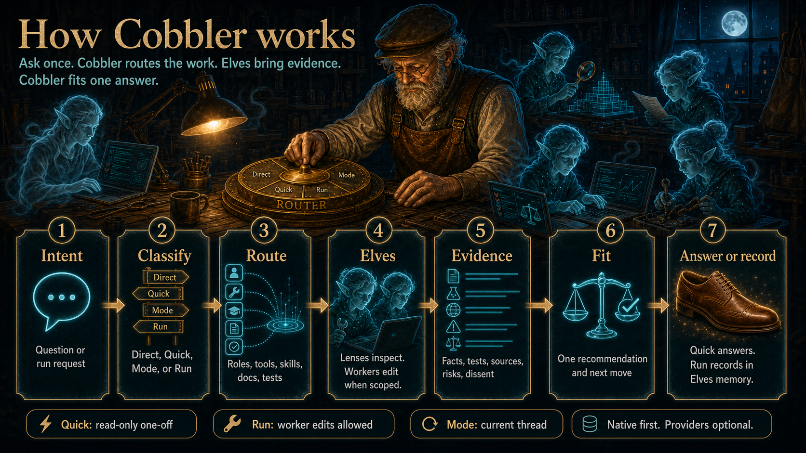

# Elves


**They work while you sleep.**

Elves is an open-source Agent Skill for **efficient, intelligent agentic workflows** (development
and research) that do not lock you into one model ecosystem. It turns large plans into unattended
multi-batch runs — implement, test, review, document — that survive context compaction.
**Cobbler** is the default coordinator. **Claude Code or Codex** is the main driver; optional work
drivers and lenses help when you already have them.

**Current release: v2.1.0.** You write the plan and own the merge decision. The agent does the middle.

**Default (v2.0+): one kickoff** after conceptual agreement — chat to agreement, then one
**Chat-to-work** or **Chat-to-land** (`chat-to-work` / `chat-to-land`) prompt stages and runs.
Single kickoff always continues after staging unless you explicitly chose legacy two-call. v2.1
adds trusted Grok full-run delegation with a quiet parked driver. See
[`references/e2e-chat-to-land.md`](references/e2e-chat-to-land.md).

Source-checkout helper: `python3 scripts/cobbler_agents.py`. For a global or project-local Claude
Code/Codex install, invoke helpers from the **active Elves skill root** while the target repository
remains the working directory; `python3 scripts/...` is source-checkout shorthand only. See
[`references/runtime-helper-paths.md`](references/runtime-helper-paths.md). Changelog:
[`CHANGELOG.md`](CHANGELOG.md).

---

## Quick start

### Install (Claude Code)

```bash
ELVES_TMP="$(mktemp -d)"
git clone https://github.com/aigorahub/elves.git "$ELVES_TMP/elves"
python3 "$ELVES_TMP/elves/scripts/sync_installed_skills.py" --apply --target claude
rm -rf "$ELVES_TMP"
```

The sync helper creates missing aliases and updates only aliases carrying the Elves-managed marker.
If it finds a user-owned alias, it reports the conflict before changing the install and never
overwrites that alias.

### Install (Codex)

```bash
ELVES_TMP="$(mktemp -d)"
git clone https://github.com/aigorahub/elves.git "$ELVES_TMP/elves"
python3 "$ELVES_TMP/elves/scripts/sync_installed_skills.py" --apply --target codex
rm -rf "$ELVES_TMP"
# Codex uses $elves … skill forms (or natural language). Do not invent top-level /cobbler.
```

Validate:

```bash
# Claude Code:
python3 ~/.claude/skills/elves/scripts/install_doctor.py --startup
# Codex (use this instead):
python3 ~/.codex/skills/elves/scripts/install_doctor.py --startup
# Elves source checkout:
python3 scripts/verify_repo.py --version 2.1.0
# before operational-artifact cleanup, from a clean worktree:
python3 scripts/verify_repo.py --version 2.1.0 --final-readiness \
  --session .elves-session.json
# after the narrow operational-artifact cleanup commit, on its clean current tip:
python3 scripts/verify_repo.py --ci --version 2.1.0 --base-ref origin/main
test -z "$(git status --porcelain)"
```

The `verify_repo.py` commands above are maintainers' gates for this Elves source checkout; that
repo-only helper is not shipped in a global skill install. Generic installed runs use their target
project's broad gates plus the installed `elves_landing_check.py`, as described in
[`references/runtime-helper-paths.md`](references/runtime-helper-paths.md).

Intentional source-checkout public-API breaks must be declared in the tracked
`api-break-approvals.json` for the exact `--version`. Every entry names one surface, a non-empty
reason, and a tracked in-repo plan. Strict verification rejects malformed, stale, untracked, or
plan-less approvals, and direct compatibility checks remain blocking unless approvals are supplied
explicitly.

For this repository, the pre-cleanup Final Readiness gate carries the authoritative session/plan
acceptance walk. The cleanup commit is a narrow post-readiness exception: it may remove only the
recorded operational session files. The strict `--ci` command plus an empty status is the final
current-tip attestation after that commit. If cleanup contains any other change or the attestation
fails, restore the run documents from the pre-cleanup commit, fix the issue, and repeat full Final
Readiness. The session must record its tracked in-repo `plan_path`; optional `--plan <path>` is only
an exact-equality assertion and must name that same path.

### First run (single kickoff)

1. Chat until the work is clear (optional multi-planner lenses).
2. Paste one **chat-to-work** prompt (see [`references/kickoff-prompt-template.md`](references/kickoff-prompt-template.md)).
3. Elves plans, stages branch/PR/docs, preflights, and **continues into batches in the same session**.
4. You return to a landable PR (or chat-to-land merge only if you opted in). **Never merge by default.**

Legacy two-call / legacy stage-then-launch (stage, then a separate launch message) remains valid only when you explicitly choose it.

---

## Installation

| Host | Path | Invocation |
| --- | --- | --- |
| **Claude Code** | `~/.claude/skills/elves` + 7 alias skills | `/elves`, `/cobbler`, `/cobbler-mode`, `/council`, `/ec`, `/elves-council`, `/setup-cobbler`, `/setup-council` |
| **Codex** | `~/.codex/skills/elves` | `$elves …` or natural language; not top-level `/cobbler` |

**Seven Claude aliases:** `cobbler`, `cobbler-mode`, `council`, `ec`, `elves-council`, `setup-cobbler`, `setup-council`.
The reviewed-landing strings `\land-pr` and `/land-pr` are in-conversation Elves commands, not an
eighth installed Claude alias directory.

**SessionStart (Claude):** point the hook at the **exact** survival-guide path for the active run
(from the Survival Guide / `.elves-session.json`), not a hard-coded default.

**Manual install:** clone or copy the skill tree; prefer `scripts/sync_installed_skills.py` (or
install doctor) over hand-maintaining a second tree. Per-project install lives under the project
`.claude/skills/elves` or `.codex/skills/elves`.

Full platform notes, updates, and Claude.ai upload: see
<details><summary>Expanded installation</summary>

### Expanded installation

Elves can be installed globally (applies to all your projects) or per-project (lives in the repo).

### Global installation (recommended to start)

Global installation means the skill is always available, no matter which project you're in. Install it once, use it everywhere, and customize it as you learn.

**Claude Code:**
```bash
# Clone and let the sync helper install the main skill plus managed aliases.
ELVES_TMP="$(mktemp -d)"
git clone https://github.com/aigorahub/elves.git "$ELVES_TMP/elves"
python3 "$ELVES_TMP/elves/scripts/sync_installed_skills.py" --apply --target claude
rm -rf "$ELVES_TMP"
```

This installs `~/.claude/skills/elves/` and seven small Claude Code alias skills:
`~/.claude/skills/cobbler/`, `~/.claude/skills/cobbler-mode/`,
`~/.claude/skills/council/`, `~/.claude/skills/ec/`, `~/.claude/skills/elves-council/`,
`~/.claude/skills/setup-cobbler/`, and `~/.claude/skills/setup-council/`. Those directories create
the seven managed aliases; every alias delegates to the same default Cobbler orchestration model
in the main `elves` skill.

**Codex:**
```bash
ELVES_TMP="$(mktemp -d)"
git clone https://github.com/aigorahub/elves.git "$ELVES_TMP/elves"
python3 "$ELVES_TMP/elves/scripts/sync_installed_skills.py" --apply --target codex
rm -rf "$ELVES_TMP"
```

Codex installs the main skill bundle only. It does not install the Claude Code slash aliases; use
`$elves cobbler: <task>` or natural language such as "Ask the Cobbler..." to invoke Cobbler.

### Per-project installation

Per-project installation puts the skill in your repo so it's versioned with your code and visible to collaborators.

**Claude Code:**
```bash
# From your project root
mkdir -p .claude/skills
git clone https://github.com/aigorahub/elves.git .claude/skills/elves
rm -rf .claude/skills/elves/.git  # remove the nested git repo

# Optional project-local aliases. Skip any alias directory you already own.
for alias in cobbler cobbler-mode council ec elves-council setup-cobbler setup-council; do
  if [ -e ".claude/skills/${alias}" ] || [ -L ".claude/skills/${alias}" ]; then
    echo "Skipping existing .claude/skills/${alias}"
  else
    cp -R ".claude/skills/elves/aliases/claude/${alias}" ".claude/skills/${alias}"
  fi
done
```

**Codex** (if your setup supports project-local skills):
```bash
mkdir -p .codex/skills
git clone https://github.com/aigorahub/elves.git .codex/skills/elves
rm -rf .codex/skills/elves/.git
```

Codex uses `$elves cobbler: <task>` or natural language such as "Ask the Cobbler..." rather than
the Claude Code slash aliases.

### Claude.ai (upload)

1. Download or clone this repo
2. Zip the `elves/` directory
3. Go to Settings > Features > Skills > Upload
4. Upload the zip file

### Validating your installation

```bash
pip install -q skills-ref
agentskills validate ~/.claude/skills/elves/  # or wherever you installed it
```

You should see: `Valid skill: ...`

### Stay updated

Star the repo to bookmark it and show support:
```bash
gh repo star aigorahub/elves
```

Watch for releases to get notified when the skill is updated:
```bash
gh api repos/aigorahub/elves/subscription --method PUT --field subscribed=true
```

If you keep a local checkout of this repo and want your installed Claude/Codex copies to match it,
use the built-in sync helper:
```bash
python3 scripts/sync_installed_skills.py --check
python3 scripts/sync_installed_skills.py --apply
```

By default, `--target all` syncs or checks only the installed copies it actually finds. Use
`--target claude` or `--target codex` if you want to inspect or create a specific platform install
explicitly.

This mirrors the managed skill bundle files from the repo into `~/.claude/skills/elves/` and
`~/.codex/skills/elves/`. For Claude Code, it also manages the small alias skills at
`~/.claude/skills/cobbler/`, `~/.claude/skills/cobbler-mode/`,
`~/.claude/skills/council/`, `~/.claude/skills/ec/`, `~/.claude/skills/elves-council/`,
`~/.claude/skills/setup-cobbler/`, and `~/.claude/skills/setup-council/` so all seven managed
slash-skill entry points are installed.

For Codex, the sync helper updates the main skill bundle only. Invoke Cobbler with
`$elves cobbler: <task>` or natural language rather than a top-level slash alias.

Installed runtime helpers are not placed on `PATH`. Resolve them from the skill that is actually
active, keep the target repository as `cwd`, and use `--repo-root` if `cwd` differs. The normal
global roots are `~/.claude/skills/elves` and `~/.codex/skills/elves`; project-local copies may
shadow them. Full examples: [`references/runtime-helper-paths.md`](references/runtime-helper-paths.md).

The sync helper intentionally ships the installable bundle only: `SKILL.md`, `AGENTS.md` (Codex),
`config.json.example`, `references/`, and the runtime scripts `scripts/preflight.sh`,
`scripts/preflight_worktree.py`, `scripts/notify.sh`, `scripts/install_doctor.py`,
`scripts/validate_survival_guide.py`, `scripts/elves_landing_check.py`,
`scripts/cobbler_agents.py`, `scripts/openrouter_lens.py`, `scripts/workspace_guard.py`, and
`scripts/cobbler_runtime/*`. Repo-only maintenance helpers such as
`scripts/check_repo_consistency.py`, `scripts/release_checklist.py`,
and `scripts/pr_portfolio_report.py` stay in the checkout.

For local PR-stack sweeps, use the repo-only helper:

```bash
python3 scripts/pr_portfolio_report.py
python3 scripts/pr_portfolio_report.py --prs 29-43 --fail-on-attention
python3 scripts/pr_portfolio_report.py --prs 29-43 --fail-on-attention --fail-on-draft
python3 scripts/pr_portfolio_report.py --json
```

Use `--fail-on-attention` for unresolved threads, pending or failing checks, requested changes, or
non-clean merge state. Add `--fail-on-draft` when the question is landing readiness rather than
health: draft PRs can be intentionally clean but still not ready for a human merge.

Claude Code aliases are marker-gated. Elves creates or updates an alias skill only when it is
missing or already contains the `elves-managed-alias` marker. If you already have your own
`~/.claude/skills/cobbler/` or Council alias skill, the sync helper reports an alias conflict and
leaves your files untouched. If you maintain hand-edited local customizations, prefer the manual
diff workflow below instead of blindly applying the sync.

To inspect what is actually installed and whether a newer published release exists:
```bash
python3 ~/.claude/skills/elves/scripts/install_doctor.py --doctor
python3 ~/.codex/skills/elves/scripts/install_doctor.py --doctor
```

The install doctor reports the active version, published release, and any project-local installs
that differ from the global copies. `scripts/preflight.sh` now runs it in startup mode
automatically when the helper is present in the bundle.

For maintainers preparing an Elves release, run the release checklist from a repo checkout:
```bash
python3 scripts/release_checklist.py
```

It checks that `SKILL.md`, `AGENTS.md`, and the latest changelog release heading agree, that the
`Unreleased` changelog section has been promoted, and that current-version examples were bumped.
The default changed-doc sweep compares committed changes against `origin/main`; commit your
release-prep changes before relying on that part of the report. During a normal development PR, use
`--allow-unreleased` to keep changelog entries as warnings while still getting the version and
changed-doc surface sweep:
```bash
python3 scripts/release_checklist.py --allow-unreleased
```

---


</details>

---


Model onboarding (optional providers): see [`references/model-onboarding.md`](references/model-onboarding.md)
and [`references/cobbler-setup-recipes.md`](references/cobbler-setup-recipes.md). Operator flow:

The command examples below use source-checkout shorthand. For an installed skill, replace
`scripts/<helper>` with `<active-elves-skill-root>/scripts/<helper>` and keep this project as the
working directory, as described in
[`references/runtime-helper-paths.md`](references/runtime-helper-paths.md).

```bash
python3 scripts/cobbler_agents.py onboard plan|show|apply|probe --json
# Writes ignored local .elves/models.toml only — never commit credentials.
# Claude: /setup-cobbler and /setup-council
# Codex: $elves setup-cobbler and $elves setup-council (not top-level /cobbler)
```

## Handling matrix (direct edit / bounded / full-run)

| Mode | When | Work driver | Git | Monitor |
| --- | --- | --- | --- | --- |
| **Direct edit** | Tiny host-owned change | host-native | host commits | interactive |
| **Bounded task** | One batch / scoped implement | optional Grok Build | host or leased | interactive |
| **Full-run (host-native)** | `full_run` / `overnight` alone | **host-native** | host | interactive / same-session |
| **Trusted Grok full-run** | explicit `trusted_grok` / `turn_over_to_grok` **and** full-run | Grok Build | **branch_progress** (feature commits/pushes) | **parked_monitor** |
| **Untrusted lease** | isolated writer | worker lease | **detached / no refs** | host import only |
| **Legacy two-call** | explicit stage-only | host-native | host | second human launch |

**Authority rules**

- Trusted fast full-run may own **feature-branch commits/pushes**.
- Untrusted lease remains **detached / no protected refs**.
- Host always owns **run memory, protected refs, PR actions, final review, and any authorized merge**;
  the user owns whether Elves may merge.
- Parked mode overrides per-push driver re-entry until a wake condition.
- `full_run` or `overnight` alone is **not** a Grok signal.

### Exact full-run recipe (primary)

```bash
# 1) Create the single host-owned launch rollback ref before handoff
python3 scripts/cobbler_agents.py implement rollback-ref --json \
  --run-id <run-id> --session-id <exact-uuid> --batch 0 \
  --head <start-head> --push

# 2) Prepare supervisor artifacts for one exact session
python3 scripts/cobbler_agents.py implement full-run-prepare --json \
  --session-id <exact-uuid> --branch <feature-branch> --start-head <sha> \
  --worktree <path> --packet <packet.json>

# 3) Background-launch Grok with exactly one explicit auth strategy.
# Existing Grok subscription/OAuth login (trusted Lane A only): share only canonical auth.json.
python3 scripts/cobbler_agents.py implement full-run-launch --json \
  --session-id <exact-uuid> --grant-grok-auth --grant-github-push

# API-key alternative (do not combine with --grant-grok-auth):
# python3 scripts/cobbler_agents.py implement full-run-launch --json \
#   --session-id <exact-uuid> --grant-env XAI_API_KEY --grant-github-push

# 4) Parked monitor (no per-push re-entry)
python3 scripts/cobbler_agents.py implement full-run-monitor --json \
  --session-id <exact-uuid>

# After reviewing an exact staged high-risk checkpoint wake:
# python3 scripts/cobbler_agents.py implement full-run-monitor --json \
#   --session-id <exact-uuid> --ack-high-risk-checkpoint <checkpoint-id>

# 5) Bounded logs when diagnosis is needed
python3 scripts/cobbler_agents.py implement full-run-logs --json --session-id <exact-uuid>

# Cancellation/recovery only — never a normal successful close step
python3 scripts/cobbler_agents.py implement full-run-stop --json --session-id <exact-uuid>
```

`full-run-stop` is an explicit cancellation/recovery command for a live or wedged worker. Do not
run it after normal completion and do not use it to manufacture a clean exit.

The full-run launcher always assigns private per-run `HOME`, temp/XDG directories, and `GROK_HOME`.
It fails before spawning Grok unless the host explicitly grants `XAI_API_KEY` by name or opts into
trusted-Lane-A `--grant-grok-auth`. The OAuth option validates the canonical owner-private host
`auth.json` and exposes only that file through Grok's native `GROK_AUTH_PATH`; it never inherits the
rest of `~/.grok`. One canonical file lets Grok's own locking and atomic refresh preserve rotating
tokens. Credential values and the canonical path never enter status summaries or bounded driver
output, and raw transcript tails are disabled for shared OAuth because historical token values may
rotate. Shared OAuth requires Grok Build 0.2.93+ with the native capability marker; unsupported
builds fail before spawn and must upgrade or use the named API-key route. Prefer that API-key route
for CI or any lane that is not trusted.

GitHub feature-branch pushes have a separate explicit auth boundary. For a non-credentialed
`https://github.com/...` origin, use `--grant-github-push` to obtain the current authenticated
host `gh` credential privately, or grant exactly one of `GH_TOKEN` / `GITHUB_TOKEN` by name. Elves
keeps the worker's HOME/XDG/Git config isolated, resets other credential helpers, installs one
launch-scoped helper that reads the token only from the child environment, and persists only keyed
digest/length metadata. SSH and other network push transports fail before spawn; local/file remotes
remain credential-free for deterministic runs and tests.

Packets declare an exact wake gate with `- High-risk checkpoint: <stable-id>`. The worker must emit
the matching `high_risk_checkpoint` event, and the host acknowledges that exact pending ID only
after review. Omitted or unacknowledged planned checkpoints block final readiness even if the worker
already wrote a complete report and exited cleanly.

Before shared-OAuth launch, Elves requires and probes an exact native Mach-O/ELF Grok executable in
an isolated, credential-free environment and binds its full safe ancestor chain through the child
pre-spawn check. The
canonical auth path must pass owner, mode, link, full-ancestor, and supported-platform ACL checks;
any executable replacement or permissive ACL fails closed.

This trusted branch-progress lane is a policy boundary, not same-user privilege separation. Its
capability-authenticated stop artifact resists malformed JSON, symlink/FIFO tricks, and accidental
marker forgery; it does not claim to resist a malicious trusted worker that deliberately reads
host-owned runtime state in violation of the lane contract.

The host creates no per-batch refs while parked. Worker commit SHAs are the internal rollback
points, and the worker never creates, moves, or pushes refs other than the assigned feature branch.

Packet contract (non-secret env the host exports to real adapters):
`ELVES_FULL_RUN_EVENTS`, `ELVES_FULL_RUN_REPORT`, `ELVES_FULL_RUN_RUN_ID`,
`ELVES_FULL_RUN_ATTEMPT`, `ELVES_FULL_RUN_SESSION`,
`ELVES_FULL_RUN_BRANCH`, `ELVES_FULL_RUN_START_HEAD`, `ELVES_FULL_RUN_WORKTREE`.

A lone `run_complete` event never establishes completion. Only a validated report with
`status: complete`, non-empty stable-id acceptance evidence, matching final feature-branch head,
verified descendant progress, a clean authenticated worker exit, and unchanged protected refs may
wake final readiness as complete. Clean exit or descendant progress without that validated complete
report is incomplete/failed evidence, never a completion fallback. Trusted Lane A is **policy
trust**, not an OS Git sandbox.

**Batch resume** (`implement resume-batch`) is the legacy/alternative path; full-run is primary for
trusted overnight Grok work. Details:
[`references/grok-implementer-launch-prompt.md`](references/grok-implementer-launch-prompt.md).

---


By default the **host agent** implements. Optional `implementation_lane: fast` routes labor
through `python3 scripts/cobbler_agents.py implement prepare|launch|gate|resume-batch|status`
(legacy batch path) or the primary full-run commands. The host-import writer lease is advanced
isolation and **not the default overnight path**.

## How it works (loop)

```
Orient → Cobbler-coordinate → Verify Green → Rollback ref → Contract → Implement → Validate → Review →
Judge → Document → Update → Push → Re-read → PR Loop → Entropy Check → Continue
```

That loop is host-native (and remains the legacy bounded-driver cadence). In a trusted Grok
full-run, the host stages once and parks; the worker runs the internal batch loop and pushes visible
progress, then the host wakes for one cumulative independent readiness/landing loop.

Elves runs a tight loop. Cobbler coordinates non-trivial decisions inside that loop: whether to
answer directly, route work to implementation agents, ask independent lenses for risk/review, use
repo tools or skills, or preserve a dissenting view before synthesis. For each batch of planned
work, either the host-native/legacy driver or the trusted full-run worker implements, validates,
reviews, documents, and pushes a meaningful checkpoint before starting the next batch. A parked
host does not duplicate that internal worker loop; it wakes once for cumulative review/recovery at
a terminal or safety condition.

The architecture is intentionally simple:

- **Elves** is the execution system: plans, branches, PRs, validation, review, memory, and landing.
- **Cobbler** is the default coordinator inside that system.
- **Domain workflows** are Cobbler-managed packs for specialized work.
- **Math** is the first domain workflow, with scouts, critics, source auditors, ledgers, and
  human-verification gates.
- **Providers** are optional role routes. They add perspective when configured; they are not the
  orchestration layer. Optional work drivers and domain tools (Grok, OpenCode, AlphaEvolve, …)
  extend the same idea without replacing Cobbler.

### Optional multi-agent tooling (when you already have the tools)

Native-only runs need none of this. When present, Cobbler may route:

| Kind | Examples | Role in Elves |
| --- | --- | --- |
| **Main driver** | Claude Code, Codex | Only supported skill hosts / overnight orchestrators |
| **Work drivers** | Grok Build (`implement …`), OpenCode labor | Trusted full-run or legacy bounded labor under host packets + gates |
| **Plan/review lenses** | OpenRouter lens, Gemini CLI, Antigravity (`agy`), Muse Spark | Independent read-only evidence |
| **Math domain tools** | OpenRouter math roles, Google **AlphaEvolve** (`evolutionary_search`) | Discovery / examples / counterexample *signals* — not proofs |
| **Writer boundary** | Host-import `worker …` lease | Advanced isolation; not the default overnight path |
| **E2E kickoffs (recommended v2.0+)** | Chat-to-work / chat-to-land | One prompt after agreement: plan→stage→run to landable PR, or through merge |

Setup: `python3 scripts/cobbler_agents.py onboard …` and recipes in
[`references/cobbler-setup-recipes.md`](references/cobbler-setup-recipes.md). AlphaEvolve details:
[`references/math-alphaevolve.md`](references/math-alphaevolve.md). E2E design and prompts:
[`references/e2e-chat-to-land.md`](references/e2e-chat-to-land.md).

### Reviewed PR landing command

Elves also has a focused landing command for the moment when a PR is basically ready but you want
one more disciplined pass before it lands:

> Get a subagent to review the diff from main, read all PR review comments, address everything that
> needs addressing, do all testing that makes sense, and merge commit once all green.

Short form inside an Elves conversation: send `\land-pr` or `/land-pr` on the PR branch. Both text
commands mean the same thing as the full command above; neither is an eighth installed alias skill.

That command is an explicit one-off merge opt-in for the current PR. The agent reads every review
surface, gets a fresh subagent review of `git diff <default-branch>...HEAD` when supported, fixes
blockers, runs sensible targeted and broad checks, waits for asynchronous reviewers and CI after
each push, re-reads the feedback queue, and finally lands with `gh pr merge --merge` only when the
PR is not draft, the worktree is clean, checks are green, and there are no unresolved requested
changes. It never squashes or rebases for this command. Agentic work should keep a merge bubble:
if the run later needs to be reverted, audited, or split apart, the merge commit gives you a clean
track to pull up without rewriting the whole history.

### The layered memory system

AI agents are stateless. Context compaction erases working memory. Elves solves this with a small
stack of persistent documents instead of one giant scratchpad:

| Document | Purpose |
|---|---|
| **Plan** | What needs to be built (the authoritative scope) |
| **Survival Guide** | Standing brief: mission, rules, tool config, current phase, next batch |
| **Learnings** | Durable, reusable lessons that should survive this run and future runs |
| **Execution Log** | Running record of every batch completed, every decision made, every commit pushed |
| **`.ai-docs/*` (optional)** | Curated durable docs for architecture, conventions, and gotchas once a learning becomes a stable repo truth |

The promotion flow is `execution log -> learnings -> .ai-docs`.

After any compaction or restart, the agent reads the stack in order and resumes without losing its
place: survival guide, `.elves-session.json`, learnings, plan, execution log, then
`.ai-docs/manifest.md` if it exists. The survival guide is marked
`# READ THIS FILE FIRST AFTER ANY COMPACTION OR RESTART` so the agent can't miss it.

Elves also practices **strategic forgetting**. Giant chats should not become permanent memory.
Chats are for execution, handoff docs are for memory, archives are for history, and fresh threads
are for speed. During long runs, the agent keeps the survival guide concise, archives old
execution-log entries in place, promotes durable lessons, reconciles idle resources, and leaves a
reactivation handoff so the next session can start from small durable docs instead of a bloated
conversation.

### Elves Reports

As of `1.10.1`, at the end of a substantial finite run, Elves creates a temporary **Elves Report**:
a static HTML report from the workers to their manager. It explains what happened while you were
away. The report is meant for the morning-after moment when you want the answer to "what did the
elves do?" without reading every line of the execution log first.

The report is generated from the durable run documents and live PR/CI state, not from the agent's
memory. It should summarize:

- final or checkpoint status, branch, PR, head SHA, and checks
- the original request and actual scope completed
- major problems found, including bugs, UX gaps, review blockers, and repeated failure patterns
- lessons learned and durable docs promoted during the run
- a batch-by-batch timeline of fixes and validation
- review loops, subagent findings, and known non-fatal warnings
- residual risks and concrete human next steps
- source links back to the plan, survival guide, learnings file, execution log, PR, and commits

The batch timeline should use collapsible sections, one per batch, so the manager can skim the
whole night and expand the work that deserves closer review.

Elves Reports are temporary by default and are not committed unless you explicitly ask for a
durable artifact. Elves prefers HTML/Markdown for this because dense accountability needs precise
text, links, and validation evidence. The page should still feel designed for the project that
produced it: use local brand assets, match the repo's tone, and avoid generic AI-dashboard patterns.
Image infographics are optional and should only be generated when you ask for them.

See [`docs/elves-report-proof-of-concept.html`](docs/elves-report-proof-of-concept.html) for a
committed proof of concept and [`references/elves-report-template.html`](references/elves-report-template.html)
for the reusable starting template. GitHub's normal file browser displays HTML files as source;
open them locally or serve them with GitHub Pages to see the rendered pages.

Committed examples should use non-identifying sample content. Real reports in `/tmp` may describe
the actual run, but public proof-of-concept pages should avoid private product names, client names,
people, or project-specific workflows.

### Math research workflows

Math research is a Cobbler-managed Elves domain workflow. It is useful for preliminary research,
proof search, source audit, paper drafting, and post-draft review. This module is beta. It is a
portable public version of a fuller Aigora workflow, pared down to prompts, ledgers, provider role
slots, and ordinary PR-based review so people can use it without our internal tools. Cobbler
classifies the research intent, builds the math context packet, routes independent scouts and
critics, synthesizes one fitted research agenda or proof-review verdict, and records domain
evidence in math ledgers. It treats a rough mathematical goal as a starting point, not as a hidden
theorem: when the target is uncertain, the first step is a Discovery Sprint with independent scouts
across relevant and adjacent subfields.

Those scouts look for related solved problems, transferable techniques, natural assumptions, and
plausible quick wins. The coordinator then synthesizes their reports into a ranked research agenda
before narrowing toward conjectures, proofs, or manuscript text. This is deliberately broader than
keyword search; some of the best opportunities come from translating results across fields that do
not use the same vocabulary.

The workflow is provider-configurable. Native host subagents or direct analysis are the default
fallback. OpenRouter is a useful optional math role preset for broad model diversity, while native
Gemini, Claude, xAI, OpenAI, Exa, and local tools can be assigned to specific roles when available.
Google Cloud AlphaEvolve is an optional evolutionary-search lane for high-quality examples and
counterexample signals when the project has a runner and deterministic evaluator (see
[`references/math-alphaevolve.md`](references/math-alphaevolve.md)); it is never a proof engine.
Missing optional provider access should be recorded with the fallback and confidence impact, but it
does not make ordinary Cobbler or math discovery unusable. Model output is never treated as
mathematical authority. It can generate ideas, stress-test proofs, check derivations, audit
references, and improve exposition, but claims are not considered verified until a human records the
proof and source checks.

Start with [`references/math-workflow.md`](references/math-workflow.md) for the operating model,
[`references/math-plan-template.md`](references/math-plan-template.md) for a ready-to-edit plan,
[`references/math-provider-config.md`](references/math-provider-config.md) for provider setup,
[`references/math-alphaevolve.md`](references/math-alphaevolve.md) for optional AlphaEvolve search,
[`references/math-review-prompts.md`](references/math-review-prompts.md) for reusable reviewer
roles, and [`references/math-artifact-ledgers.md`](references/math-artifact-ledgers.md) for claim
and source traceability.

### Cobbler

Cobbler is the default orchestration model inside Elves. During staged and active Elves runs, it is
how the coordinator decides what to do before it acts. It answers directly when the request is
simple, asks independent lenses when uncertainty matters, assigns scoped workers when repo changes
are needed, and records material run decisions in existing Elves memory. Explicit `/cobbler` or
`$elves cobbler: ...` invocations are the one-off chat form of the same coordination model.



For the full walkthrough, see [`docs/cobbler.md`](docs/cobbler.md).

The user gets the fit, not the chatter: `Recommendation`, `Why this fits`, `Strongest dissent`,
`Risks`, `Next move`, and `Confidence`.

The Cobbler harness loop is: intent, capability scan, route and medium selection, context packet,
execute agents/tools/skills, collect evidence, fit answer, present/record, and reclassify when new
facts change the task. In plain terms, Cobbler checks what help is available, chooses the right
agents, tools, skills, docs, tests, and output medium, gives each role the same bounded context,
assembles the evidence, preserves the strongest objection, and returns one recommendation.

Use `/cobbler <task>` in Claude Code when the alias skill is installed. In Codex, use
`$elves cobbler: <task>` or natural language such as "Ask the Cobbler..." Compatibility aliases
remain supported: Claude Code keeps `/council`, `/ec`, and `/elves-council`, while Codex keeps
`$elves council: <task>` and natural Council references. They all invoke the same default Cobbler
orchestration model.

Host honesty matters. Claude Code gets real slash-skill aliases through the managed alias skills.
Codex users should not need or expect a top-level `/cobbler` command; `$elves cobbler: <task>` is
the reliable Codex form.
Goals are for full Elves runs, not Quick Cobbler.

Cobbler Mode is the lowest-friction way to keep talking to the Cobbler across follow-up prompts in
one thread. In Claude Code, use `/cobbler-mode` when the managed alias skill is installed. In
Codex, use `$elves cobbler-mode` or say naturally: "Cobbler Mode: on" or "From now on, answer as
the Cobbler until I say Cobbler Mode: off." While active, the agent treats each follow-up as
Cobbler-mediated by default: direct answer for simple questions, Quick Cobbler lenses when extra
perspective helps, and full Elves run coordination when you ask it to change the repo. It is
current-thread conversation state, not durable run state, a daemon, provider requirement, or Codex
slash command. Exit with "Cobbler Mode: off" or "leave Cobbler Mode."

Cobbler-first coordination is the default for Elves runs. The main coordinator still owns durable
memory, protected refs, PR actions, any authorized merge, and final synthesis. The exact registered
trusted `branch_progress` worker may commit/push only its assigned feature branch; untrusted workers
remain detached and host-imported. In this model, worker agents may edit the repo only when an
active route or batch contract assigns implementation work.

After an Elves invocation starts a staged or active run, Cobbler stays the default posture for that
Elves session. The survival guide records this under `## Cobbler Session State`, and
`.elves-session.json` records it under `cobbler.default_for_session`, so a compacted or resumed
agent keeps using Cobbler without you repeating the invocation. This durable run state is separate
from Cobbler Mode, which is only a current-thread chat setting.

Quick Cobbler is the default one-off answer mode. It is read-only, stateless, and
native-subagent-first: Codex uses Codex subagents, Claude Code uses Claude Code subagents, and
environments without subagents perform the same read-only analysis directly. Cobbler chooses a
small role set, usually two or three lenses, gathers bounded independent reports, and answers with
the fitted-answer headings above. It does not edit files, create branches, open PRs, install
packages, or mutate run state.

Provider-backed council is optional. It can be configured later for external provider diversity,
but ordinary Cobbler use and compatibility-alias use require no OpenRouter or other provider key.
The pattern borrows the useful harness idea of independent role reports followed by synthesis
without importing vendor identity, policy, persona, or safety text.

Optional model routing stays behind the same Cobbler interaction. The default route is the host's
native subagents; configured role routes like `openrouter:<model-id>` are opt-in (any OpenRouter
model via named presets when `OPENROUTER_API_KEY` exists). Meta Muse Spark 1.1 is the same kind of
opt-in lane (`META_API_KEY` / `MODEL_API_KEY`, catalog id `muse-spark-1.1`, e.g. preset
`meta-muse-spark11`) for planning and independent review. Missing keys fall back to native.
Weigh evidence rather than model prestige.

For full Elves runs, the Cobbler can prefer different elves for different phases. Add optional
`model-routing` preferences during staging when implementation, validation, review, scouting, or
synthesis should use different host-native lenses. These preferences are advisory unless the host
or configured provider can actually honor them; missing optional provider access falls back to
host-native work and is logged only when it changes risk or confidence. `required: true` is an
explicit survival-guide opt-in, never a Quick Cobbler default.

Validate local route preferences without launching models:

```bash
python3 scripts/cobbler_agents.py validate-config --json
python3 scripts/cobbler_agents.py doctor --json
python3 scripts/cobbler_agents.py setup --json --dry-run
```

**Model onboarding** (same on Claude Code and Codex): choose which tools handle planning /
implement / review, update later, and probe that routes work — see
[`references/model-onboarding.md`](references/model-onboarding.md).

```bash
python3 scripts/cobbler_agents.py onboard plan|show|apply|probe --json
```

Setup writes only ignored local `.elves/models.toml` (never stage it; never paste keys). Claude Code:
`/setup-cobbler` (primary) or `/setup-council` (compatibility). Codex: `$elves setup-cobbler` or
`$elves setup-council` / natural language — not a top-level Codex slash command. Recipes:
[`references/cobbler-setup-recipes.md`](references/cobbler-setup-recipes.md). Master unattended loop:
[`references/councilelves-launch-prompt.md`](references/councilelves-launch-prompt.md).

Run a native-only parallel read-only council smoke (host synthesis still owns the fitted answer):

```bash
python3 scripts/cobbler_agents.py council --json \
  --task "review this batch contract" \
  --roles architect,skeptic,tester \
  --target-quorum 2
python3 scripts/cobbler_agents.py lightweight-review --json \
  --task "quick utility check"
```

**Exact session registry helpers** (no paid launch on resume argv build):

```bash
python3 scripts/cobbler_agents.py session list --json
python3 scripts/cobbler_agents.py session probe --json --session-id <exact-id>
python3 scripts/cobbler_agents.py session resume --json \
  --session-id <exact-id> --adapter grok-build --cwd /verified/worktree
```

Copy schema ideas from [`references/models.toml.example`](references/models.toml.example) into the
ignored checkout file `.elves/models.toml` (never stage it). Effective routes for a real run still
belong in the Survival Guide snapshot. Private council transcripts and session registry files stay
under ignored `.elves/runtime/` (`council/`, `sessions/`). Never commit transcripts or auth stores.

**Session troubleshooting:** always use exact session IDs. Bare `--resume` / `--continue` / `--last`
are forbidden. Grok worktree children get a new UUID — resume the child from its registered
worktree, and do not treat headless worktree-resume on Grok 0.2.93 as isolation. Remaining
subscription quota is `unknown` unless a harness explicitly exposes it.

**Who implements:** by default the **host agent** (Claude Code or Codex) implements the batch.
External implementers and multi-model planning/review are optional when those tools are installed
and configured — same native-first rule as the rest of Cobbler and the math module.

**Optional external work driver** (e.g. Grok Build, only if you have it): record
`implementation_lane: fast` and use
`python3 scripts/cobbler_agents.py implement full-run-prepare|full-run-launch|full-run-monitor|full-run-logs`
for the primary trusted full-run path; `full-run-stop` is cancellation/recovery only.
`prepare|launch|gate|resume-batch|status` is the explicit legacy/bounded-batch path.
See [`references/grok-implementer-launch-prompt.md`](references/grok-implementer-launch-prompt.md).

Hard external council subprocesses require a recursive boundary acquired atomically with the child
process. The current Python runtime cannot prove that boundary on Linux or macOS—even with a
bubblewrap PID namespace—so optional routes fall back to the host-native lane and required routes
block before snapshot creation or spawn. The
legacy bounded `implement launch --exec` / `resume-batch --exec` convenience has no qualified
boundary on either supported OS and therefore fails closed before spawn; its default print-only
argv workflow remains available. This does not disable host-native work or the separate trusted
full-run route, whose same-user contract promises process-group plus observed-known-descendant
cleanup, not malicious-worker recursive isolation.

**Optional stricter host-import writer** (advanced lease path — not the default overnight path):

```bash
python3 scripts/cobbler_agents.py worker prepare --json \
  --lease-id lease-1 --host-checkout . --worker-checkout /path/to/detached \
  --session-id <exact-child> --base-head <sha> --adapter grok-build \
  --qualification-file /host-private/qualification.json \
  --allowed-path scripts/ --allowed-path tests/ \
  --grant-env XAI_API_KEY
python3 scripts/cobbler_agents.py worker audit --json --lease-id lease-1 \
  --grant-env XAI_API_KEY
python3 scripts/cobbler_agents.py worker export --json --lease-id lease-1 \
  --output-dir /tmp/lease-1-patches --host-apply-check
python3 scripts/cobbler_agents.py worker import --json --lease-id lease-1
<run the batch's targeted and broad validation commands>
git commit -m "[<branch> · Batch N/total · Implement] <concrete outcome>"
python3 scripts/cobbler_agents.py worker refresh --json --lease-id lease-1 --new-tip <host-sha>
```

The qualification file must be host-issued private evidence for the exact registered session,
adapter, model/profile, checkout, source HEAD, and observed write capability; a worker-authored
boolean does not qualify a lease. Only one live lease is allowed. Worker detached commits are
host-imported only; `worker import` descriptor-reads the manifest and patches once, proves and
applies those exact retained bytes through Git stdin, validates the imported tree, and leaves branch
commits/push/PR/run-memory to the host. Do not reopen exported patch paths or use a shell glob as an
import authority.
If this advanced path grants a launch-scoped credential, pass its environment variable **name**
(never `KEY=VALUE`) to both `worker prepare` and `worker audit`, with the same value present in the
host environment both times. Prepare persists only private random-key HMAC/length authority; audit
requires the exact name set and value match so an unset or rotated opaque grant cannot escape the
secret scan. Omit `--grant-env` from both commands for a credential-free lease.

Start with [`references/council-workflow.md`](references/council-workflow.md) for the operating
model, [`references/council-prompts.md`](references/council-prompts.md) for reusable role and
synthesis prompt templates, and
[`references/council-provider-config.md`](references/council-provider-config.md) for optional
provider-backed council setup.

### One kickoff (recommended) vs stage-then-launch (legacy)

Historically, Elves asked for **two human calls** (stage, then launch). That failed often: people
skipped or half-did staging, and the overnight run never really started. **v2.0+ recommends a single
kickoff** once you and the agent (optionally with other planners) agree on the work:

1. **Chat** to conceptual agreement (scope, non-negotiables, merge or not).
2. **One prompt** — **chat-to-work** (landable PR, no merge) or **chat-to-land** (through merge
   ceremony). The agent owns plan materialization, staging, batches, and labor re-drive.
3. **Optional** `/goal` (Codex) or host continuation as a seatbelt so the main driver keeps going.

Internally the agent still **stages before coding** (plan on disk, branch, PR, survival guide,
preflight). It does **not** stop after staging to wait for a second human “go” in E2E mode.

**Legacy two-call handoff** remains available for huge or still-unstable plans: stage until
launch-ready, stop, then a short launch prompt. Templates:
[`references/kickoff-prompt-template.md`](references/kickoff-prompt-template.md).

### One run, one branch, one checkout

An Elves run owns its branch and its working tree. Never point two agents at the same branch or the
same checkout. If Claude and Codex (or two Elves runs) write to one branch in one directory, they
overwrite each other's files and move the branch out from under each other mid-run.

When more than one agent may touch the same repo, give each run its own
[git worktree](https://git-scm.com/docs/git-worktree):

```bash
./scripts/preflight.sh --create-worktree <branch> --base origin/main
```

Use `--dry-run` first to print the exact `git worktree add -b ...` command without creating
anything. The helper prints the branch, worktree path, base ref, and collision tripwire; it does not reuse, delete, or repair existing worktrees. A solo run in a repo no other agent will touch can
use the main checkout. Either way, preflight inspects `git worktree list --porcelain` and fails if
the current branch appears in more than one worktree. The agent also records the branch tip at
staging as a collision tripwire. An advance is expected only when the exact registered trusted
full-run session advances its assigned feature branch to a descendant of the last observed tip and
the supervisor verifies the process fingerprint and protected refs unchanged. Any other tip move
is a collision, so the host stops instead of committing on top.

For source checkouts, `scripts/workspace_guard.py` is an optional prototype helper that can check a
candidate write command against `.elves-session.json` workspace-guard state. It is advisory by
default, tracks `allowed_head_tip` and `expected_remote_tip` instead of treating the staging tip as
permanently valid, and does not install hooks or repair git state.

### Codex Goals

Codex Goals can be a useful continuation backend for Elves. Goals keeps Codex working across turns;
Elves tells it what "working well" means. On host-native and legacy bounded routes, the Goal runs
the full per-batch loop. On a trusted Grok full-run, the Goal creates the `b0` launch ref, launches
one exact worker session, then stays parked on bounded monitor reads—no per-batch review, memory, or
push chatter—until a terminal or safety wake triggers one cumulative final review. Unchanged
healthy polls produce no chat. Polling defaults to half the stale window (60-second floor, 5-minute
cap), and the host coalesces nonterminal progress into at most one short update per 15 minutes.

Goals are for full Elves runs, not Quick Cobbler. For a one-off Cobbler answer in Codex, use `$elves cobbler: <task>` or ask naturally: "Ask the Cobbler to..."

If your Codex install supports `/goal`, stage the Elves run normally, then launch the prepared
Elves prompt inside a goal:

```text
/goal The run is staged. Start now.
Read `.elves-session.json` first and resolve its exact `survival_guide_path`, `learnings_path`,
`plan_path`, and `execution_log_path`; do not substitute generic filenames. Read the file at
`<survival_guide_path>` first, then `<learnings_path>` if it exists, then `<plan_path>`, then
`<execution_log_path>`, then `.ai-docs/manifest.md` if it exists.
Use the survival guide Stop Gate and Elves Readiness Gate as the definition of completion.
If the goal budget is exhausted before readiness is clean, write a reactivation handoff, push, and
do not claim the run is complete.
```

Do not replace the Elves execution contract with Goals. Goals handles continuation; Elves handles
planning, route selection, documentation, strategic forgetting, and merge-readiness. Re-drive a
trusted worker only after a bounded return or terminal/safety wake, never after a healthy internal
batch. See
[`references/codex-goals.md`](references/codex-goals.md) for the full pattern.

### Common launch failures to head off

- **Big plan plus "run now" in one message:** the agent should stage first, then continue into
  implementation in the same run once launch-ready. Wait for another launch command only when the
  user explicitly chose legacy two-call.
- **Plan still changing during launch:** keep staging. Do not launch from unstable docs.
- **No branch, PR, or preflight yet:** still staging. Get the runway clear first.
- **Launch prompt repeats the whole plan:** trim it. The plan lives on disk; the launch prompt
  should mostly reinforce behavior.
- **No return time given:** Elves defaults to an 8-hour window unless the run is explicitly
  open-ended.

### The human sandwich

The shape of productive work is changing. The human operates on both ends: specifying problems and reviewing output, while the agent runs loops in the middle.

- **Front end (human):** Decide what's worth working on. Write the plan. Specify the problem fully. 30 minutes to an hour.
- **Middle (agent):** Open a branch, commit the plans, open a PR, then run the selected route. In
  host-native/legacy mode, the host implements, validates, reviews PR feedback, fixes, and pushes
  each batch. In trusted full-run mode, one worker runs and pushes its internal batches while the
  host parks on bounded telemetry, then the host performs one cumulative independent review at
  wake/exit. Either route can run for hours or days while you sleep.
- **Back end (human):** Review the output. By the time you look at the PR, every batch has already been through multiple rounds of implement-test-review-fix. Your review is a final pass on work that's already tight, not a first look at raw output. 30 minutes to an hour.

By default the agent never merges; that gate stays with you. You can opt in to having it land a regular merge commit once the final readiness review is green (never a squash). For agentic work, prefer merge commits because they preserve the run as a single inspectable unit that can be reverted or dissected later.

### What to expect

**The elves won't do the job perfectly.** That isn't the goal. The goal is leverage. AI returns drafts, not finished products. But the drafts are refined through dozens of Ralph Loop iterations, and by the time you review the work, it's far closer to done than anything you could have produced in the same wall-clock time. See [Water the Tree](https://x.com/johnennis/status/2034300044212351114) for the full philosophy.

The math is striking. You spend 30 minutes writing a plan. The agent runs for 10-20 hours. You spend 30-60 minutes reviewing the PR. In that 1-2 hours of your time, you may get weeks or months of equivalent human output. The exact multiplier depends on your project, your plan quality, and your test infrastructure, but ratios of 100:1 to 500:1 (agent hours per human hour) are real. In practice, users have reported getting 6-9 months of equivalent work done in a total of 3-4 hours of human time across planning, monitoring, and review.

This is the leverage that makes the setup cost worth it. A half hour of planning unlocks days of autonomous execution.

### Riding along

You don't have to leave. You can watch the agent work, check in, give it additional context, or adjust priorities on the fly. Prefix your message with **`ra:`** or **`[ride-along]`** and the agent will handle your input and keep going without stopping.

`ra:` is the quick everyday shorthand. `[ride-along]` and `ride-along:` also work if you want something more explicit. Think of it as a walkie-talkie: press the button, say your piece, release, and the agent keeps working. It responds in 1-3 sentences and resumes immediately. No follow-up questions, no pause.

Good: `[ride-along] The payment tests are expected to fail. Ignore them.`
Good: `[ride-along] Quick question: did you update the migration?`
Good: `[ride-along] Skip batch 4, do batch 6 next.`
Good: `ra: skip batch 4, do batch 6 next.`
Bad: "What do you think we should do about the database schema?" (no tag, agent may pause)
Bad: "Looks good so far." (no tag, no instruction to continue)

---


## Features

- **Multi-batch execution** with configurable batch sizing (default: 4 developers × 2-week sprint)
- **Single-kickoff default**: chat-to-work or chat-to-land stages internally, then continues into
  execution without a second human message; legacy two-call staging remains available for unstable plans
- **Codex Goals compatibility**: use `/goal` as an optional continuation backend while Elves keeps
  ownership of planning, review, memory hygiene, and readiness
- **Layered memory system**: reads survival guide, `.elves-session.json`, learnings, plan, execution log, and `.ai-docs/manifest.md` (if present) after compaction
- **Strategic forgetting**: keeps active docs and sessions lean during long runs, archives old log
  history in place, promotes durable knowledge, and leaves reactivation handoffs for fresh threads
- **Elves Reports**: substantial finite runs end with a temporary static HTML worker-to-manager
  report that highlights status, problems found, lessons learned, collapsible batch timeline,
  validation, residual risks, and human next steps; the agent hands it to you to review at closeout
- **Cobbler-first run coordination**: Cobbler is the default way Elves routes agents, tools,
  skills, evidence, dissent, and synthesis during staged and active runs
- **Quick Cobbler**: `/cobbler` in Claude Code and `$elves cobbler: ...` in Codex give you a
  read-only, native-subagent-first fitted answer for one-off planning, design, debugging, and
  review questions; Claude keeps `/council`, `/ec`, and `/elves-council`, while Codex keeps
  `$elves council: ...` as the compatibility path
- **Cobbler Mode**: `/cobbler-mode` in Claude Code and `$elves cobbler-mode` in Codex keep
  follow-up prompts Cobbler-mediated in the current thread until you say `Cobbler Mode: off`
- **Run-level Cobbler session state**: staged and active Elves runs record `## Cobbler Session
  State` and `.elves-session.json` `cobbler.default_for_session` so compaction does not lose the
  Cobbler-first posture
- **Optional model routing**: Cobbler roles can be mapped to native subagents or provider-backed
  models when keys are configured, but native host subagents remain the zero-config default and
  fallback
- **Full-run model routing**: optional `model-routing` preferences let the Cobbler record requested
  and actual routes per phase while staying native-first and provider-optional
- **Math domain workflow kit**: Cobbler-managed templates for preliminary discovery, subfield
  scouting, cross-field synthesis, proof review, source audit, manuscript drafting, and human
  verification
- **Documentation freshness in the loop**: review can raise `PENDING-DOCS`, learnings promote reusable lessons, and stable truths can move into `.ai-docs/*`
- **Auto-discovered validation gates** for Node.js, Python, Go, Rust, and Makefile projects. No configuration required.
- **Pluggable review**: GitHub PR comments by default (zero config), custom review API opt-in, additional custom checks
- **Subagent delegation** for long runs: host-native/legacy coordinators manage the per-batch loop;
  trusted full-run workers own their internal loop while the coordinator parks
- **Rollback safety**: host-native/legacy runs use host-owned `bN` refs; trusted parked full-runs
  use one host-owned `b0` launch ref plus worker commit SHAs as internal rollback points
- **Scout mode**: after all planned work is done, the agent looks for adjacent improvements, test gaps, and documentation holes. Prioritizes risk-reducing fixes first, then quality, then leaves ambiguous items. Commits tagged `[branch · Scout]`, with validation gates required and clear stop rules.
- **Proof scope**: touched-surface proof per batch (only test what you changed), broad regression at entropy checks and before readiness. Re-earn proof after each push; don't inherit from prior commits.
- **High-risk regression pass**: batches with medium/high blast radius can trigger a second,
  regression-only review pass that traces changed shared surfaces to their consumers and asks only
  "what could this break?"
- **Public API surface snapshots**: optional regression evidence for REST, GraphQL, exported
  library, CLI, event, and configuration contracts. `enabled: auto` stays advisory when no credible
  source exists; `required: true` is only an explicit survival-guide opt-in.
- **Final readiness review**: the final step of every run is a fresh cumulative review of
  `git diff <default-branch>...HEAD`. Read every PR comment, run every test that makes sense, and
  confirm checks, docs, and memory hygiene, so you can be confident the branch is green to merge.
  Then you get the Elves Report to review, and either you merge or (opt-in) the agent lands a
  regular merge commit on green (never a squash)
- **Reviewed PR landing command**: for an attended landing, ask Elves to get a subagent to review
  the diff from main, read all PR comments, fix blockers, run sensible tests, wait for review/CI
  updates, and land with a regular merge commit once green
- **Lightweight process retro**: entropy checks can tune the loop itself when the same friction
  repeats, for example by tightening the survival guide, templates, or tool config after repeated
  review findings
- **Run isolation**: one run owns one branch and one checkout; when agents may share a repo, each
  run gets its own `git worktree` through `./scripts/preflight.sh --create-worktree <branch>
  --base origin/main`. The exact registered trusted full-run session may advance only its assigned
  feature branch to a descendant while fingerprint and protected-ref checks remain clean; every
  other tripwire move is a collision
- **Merge conflict handling**: when `git push` fails due to a diverged remote, the agent fetches and merges (never rebases), resolves conflicts or triggers a Hard Stop
- **Two run modes**: finite (deadline-based, default) or open-ended (continue until explicitly stopped). Open-ended mode also covers "checkpointed continuation" runs like "have something by 8am, then keep going." A morning checkpoint, return time, or delivery target is not a stop condition unless the survival guide explicitly marks it as a hard stop.
- **Live operator brief**: the survival guide is rewritten in place as the run evolves. `Run Control`, `Current Phase`, `Active Compute`, `Stop Gate`, and `Next Exact Batch` stay current; the execution log carries history.
- **Explicit Stop Gate**: the survival guide records whether stopping is currently allowed, why, and what the next required action is. Stopping is positive permission, not a guess.
- **Explicit Effort Standard**: the survival guide and launch prompt tell the model not to be lazy, to work as hard as it can for the full run, and to avoid coasting after the first green check or checkpoint.
- **Time-aware pacing**: tracks how long each batch takes and uses that to decide whether to start another batch or wrap up cleanly (finite mode)
- **Slack notifications** (or any custom command): know when your run finishes without watching the terminal
- **Constitution and legality check**: human-authored deal-breaker behaviors (`docs/constitution.md`) verified by a read-only judge after each batch. Three quality layers: correctness (tests), plan compliance (review), legality (judge). Success criteria the agent didn't author.
- **PR Loop**: poll PR comments, inline reviews, and checks after every host push; trusted parked
  full-run worker pushes are reviewed cumulatively at wake/exit rather than reactivating the driver
- **Readiness Gate**: branch-level checklist before declaring review-ready (plan Acceptance with proof, `elves_landing_check.py` clean, local proof on current tip, preview proof on exact runtime tip, final cumulative review, PR comments polled, legality check clean, strategic forgetting complete, git status clean, execution log current). Green CI + `status: complete` alone is not landable.
- **Acceptance evidence (v1.19+/v2.0+)**: each complete batch records criterion-to-proof rows in
  `.elves-session.json`; v2.1 new plans use stable batch `B#`, batch-acceptance `B#-A#`, and
  branch-level `M-A#` ids, while legacy rows receive deterministic document-order aliases. God-file
  splits cannot close on structure/regex locks alone; prefer one batch per close commit. v1.20
  added optional external-agent orchestration under Cobbler; v1.20.1 hardened that runtime so
  green tests cannot stand in for real model/session/write evidence; **v2.0.0** is Cobbler-managed
  multi-model orchestration (native-first hosts + optional work drivers, lenses, and math tools
  such as AlphaEvolve).
- **Structured session data** in `.elves-session.json` for tooling, dashboards, and analytics
- **Install doctor and update advisory**: startup can flag newer published releases and explain
  when a project-local install differs from the global one that you thought you were using
- **Ride-along protocol**: prefix messages with `ra:`, `ride-along:`, or `[ride-along]` to interact during a run without stopping the agent. The agent responds in 1-3 sentences and resumes immediately.
- **Comprehensive preflight checks**: git remote, push access, GitHub CLI auth, test gates, sleep prevention, Slack webhook, stale branch detection, workspace ownership, duplicate branch checkout detection

---


## Preventing sleep / shutdown

This is the most common failure mode for overnight runs. If your machine sleeps, the session stops. Handle this before you walk away.

### macOS

```bash
# Prevent display, idle, and system sleep for the duration of your terminal session
caffeinate -dims &
```

Or wrap your agent command: `caffeinate -dims <your-agent-command>`

Elves preflight will warn you if `caffeinate` isn't running and if you are on battery power.

### Linux

```bash
systemd-inhibit --what=idle <your-agent-command>
```

### Windows (WSL)

Open Power Options → Change plan settings → set "Put the computer to sleep" to **Never** for the duration of the run. Restore it afterward.

### Cloud / remote (recommended for reliability)

Running on a cloud VM, GitHub Codespaces, or a remote server eliminates the sleep problem entirely. The session runs independently of your local machine. This is the most reliable option for very long runs.

### SSH sessions

If you're running over SSH, your session dies when the connection drops. Always use a terminal multiplexer:

```bash
# Start a new tmux session
tmux new -s elves

# Run your agent inside tmux, then detach with Ctrl+B, D
# Reconnect later with:
tmux attach -t elves
```

`screen` works the same way: `screen -S elves`, detach with `Ctrl+A, D`, reattach with `screen -r elves`.

### Suppress surveys and popups

Some coding tools show survey popups, feedback requests, or update prompts during sessions. These will stall an unattended run. Configure your tools before starting:

- **Claude Code:** add to your CLAUDE.md: `"Do not show surveys, popups, or update prompts during this session."`
- **Codex:** add to your AGENTS.md: `"Never pause for surveys, feedback requests, or update prompts."`
- **Cursor / other tools:** check settings for telemetry, notifications, and update checks. Disable anything interactive.

### Pre-run checklist

- [ ] Agent has the permissions it needs (file access, git push, `gh` auth, any tool approvals). If your platform requires you to approve actions (file writes, terminal commands, etc.), grant those permissions before you walk away. A permission prompt at 3am with nobody to click "allow" will stall the entire run. You're granting these permissions at your own risk. See [Disclaimer](#disclaimer).
- [ ] Machine is plugged in (not on battery)
- [ ] Sleep / display sleep is disabled or caffeinate running
- [ ] Terminal is in tmux/screen (if SSH) or won't be closed
- [ ] Surveys and popups disabled in your coding tool's settings
- [ ] Branch ownership is manually confirmed: no other active agent is using this checkout or this branch. Preflight will catch duplicate current-branch worktrees.
- [ ] Notifications are configured so you know when the run finishes
- [ ] Preflight passed (Elves will verify the above automatically)

---


## Monitoring your run

You don't need to watch the terminal. Here's how to check in from elsewhere.

**GitKraken** is the recommended way to monitor visually. Open it on the working branch and watch:
- **Commit graph**: steady commit cadence means the agent is making progress. A long gap may mean a slow test suite, a stuck review cycle, or an unexpected blocker.
- **Branch activity**: new commits appear as the agent completes each batch and pushes a checkpoint.
- **PR status**: review comments arriving on the PR means the review step is working.

**Slack notifications** deliver a completion message when the session ends (or when a batch completes, if you configure that). You can check your phone without opening a terminal.

**The execution log** is the most detailed view. Each batch entry records what changed, what commands ran, what the test results were, how long each phase took, and what decisions were made autonomously. Read it when you return to understand exactly what happened.

---


## Setting up notifications

### Slack (recommended)

1. Go to [api.slack.com/apps](https://api.slack.com/apps) and create a new app (from scratch).
2. Under **Features**, select **Incoming Webhooks** and enable it.
3. Click **Add New Webhook to Workspace** and select the channel where you want notifications.
4. Copy the webhook URL (it looks like `https://hooks.slack.com/services/T.../B.../...`).
5. Set the environment variable before starting your session:

```bash
export ELVES_SLACK_WEBHOOK="https://hooks.slack.com/services/YOUR/WEBHOOK/URL"
```

Elves preflight will send a test message to confirm the webhook works before you walk away.

### Custom notifications

Set `ELVES_NOTIFY_CMD` to any shell command you want run at session completion:

```bash
# Example: send a push notification via ntfy
export ELVES_NOTIFY_CMD='curl -d "Elves done" ntfy.sh/your-topic'

# Example: send an email via sendmail
export ELVES_NOTIFY_CMD='echo "Elves session complete" | sendmail you@example.com'
```

If neither `ELVES_SLACK_WEBHOOK` nor `ELVES_NOTIFY_CMD` is set, Elves falls back to leaving a comment on the PR.

---


## Configuration

### Persistent preferences

Copy [`config.json.example`](config.json.example) to `config.json` in your installed skill or
project-local skill when you want defaults to persist across sessions. Put new Cobbler preferences
under the top-level `cobbler` block. The legacy `council` block is for compatibility with older
projects; if both blocks are present, `cobbler` wins.

Math preferences belong under `math`. The default math route is native-first with optional external
routes; `OPENROUTER_API_KEY` belongs in optional environment/config examples unless a project
survival guide explicitly requires it for that run.

### Tool configuration

Tool-specific configuration lives in the survival guide under `## Tool Configuration`. This keeps the agent's instructions with the session rather than scattered across environment variables.

See [`references/tool-config-examples.md`](references/tool-config-examples.md) for full examples covering Node.js, Python, Go, Rust, monorepos, and custom review APIs.

**Minimal Node.js example** (add to survival guide):

```markdown

## Tool Configuration

### Validation Gates
- lint: `npm run lint`
- typecheck: `npm run typecheck`
- build: `npm run build`
- test: `npm test`

### Review
- method: github-pr-comments
```

If you don't configure validation gates, Elves auto-discovers them from your project files (`package.json`, `Makefile`, `pyproject.toml`, `Cargo.toml`, `go.mod`).

### Batch sizing

The default batch size is what a team of 4 developers would accomplish in a 2-week sprint: roughly 40 person-days of effort. This limits blast radius and makes compaction recovery tractable.

Override in your plan or survival guide:

```markdown

## Batch Sizing
- team-size: 2
- sprint-length: 1 week
```

Each batch must be independently shippable: code, tests, docs, and passing review before moving on.

### Review methods

| Tier | Method | Configuration |
|---|---|---|
| **Tier 1** | GitHub PR comments + built-in review | Default (zero config). Agent uses a review subagent when supported; otherwise it performs the same analysis directly. It reads PR comments, the diff, and the plan, fixes blockers, and iterates until the batch is clean. |
| **Tier 2** | Custom review API | Set `method: custom-api` and `review-api-url` in survival guide. |
| **Tier 3** | Additional checks | Smoke tests, screenshot diffs, doc checks, or any custom script returning 0/non-zero. |

The agent uses the highest tier you have configured. Non-blocking findings are logged; persistent false positives (3+ cycles) are assessed and dismissed with a written explanation in the execution log.

### Memory hygiene

Long runs should clean up as they go. The default behavior is conservative: keep live docs concise,
archive old execution-log entries in place, promote durable lessons, stop idle resources, and write
a reactivation handoff when a fresh thread would be faster. Elves does **not** delete local app
state, chat databases, installed skills, plugins, or automations as part of a coding run.

If you want a local Codex/Claude cleanup routine, run it as explicit maintenance: inspect first,
back up important state, archive rather than delete, close the app before touching local state
databases, and verify config/state afterward. See
[`references/autonomy-guide.md`](references/autonomy-guide.md) for the full safe-maintenance
pattern.

---


## File structure

```
elves/
├── SKILL.md                              # Portable skill instructions (Claude Code, Codex, Claude.ai)
├── AGENTS.md                             # Codex-facing repo-local instructions for working on Elves itself
├── README.md
├── CHANGELOG.md                          # Version history
├── TODO.md                               # Project backlog and deferred tasks
├── LICENSE
├── api-break-approvals.json              # Version-scoped intentional public-API changes
├── config.json.example                   # Persistent preferences template
├── assets/
│   ├── cobbler-infographic.png           # Cobbler flow infographic
│   ├── elves-banner.jpeg                 # README banner image
│   └── elves-social-preview.png          # GitHub social preview
├── docs/
│   ├── cobbler.md                        # Human-facing Cobbler walkthrough
│   └── elves-report-proof-of-concept.html
├── references/
│   ├── survival-guide-template.md        # Bootstrap template for new projects
│   ├── execution-log-template.md         # Log entry template
│   ├── plan-template.md                  # How to write a good plan
│   ├── kickoff-prompt-template.md        # Copy-paste prompts for staging and launching a run
│   ├── codex-goals.md                    # How to launch Elves inside Codex Goals
│   ├── tool-config-examples.md           # Configs for Node, Python, Go, Rust, etc.
│   ├── validation-guide.md               # Detailed validation gates and auto-discovery
│   ├── autonomy-guide.md                 # Non-interactive operation and mid-run protocols
│   ├── review-subagent.md                # Built-in review protocol and adversarial review
│   ├── council-workflow.md               # Cobbler workflow and Council compatibility path
│   ├── council-prompts.md                # Cobbler role and fitted-answer prompt templates
│   ├── council-provider-config.md        # Optional provider-backed council setup
│   ├── math-workflow.md                  # Cobbler-managed math domain workflow
│   ├── math-provider-config.md           # Optional math role routing
│   ├── math-review-prompts.md            # Math scout, critic, auditor, and editor prompts
│   ├── math-artifact-ledgers.md          # Claim/source/model-call/human verification ledgers
│   ├── verification-patterns.md          # Headless browser, video recording, state assertions
│   └── open-ended-guide.md              # Open-ended mode patterns, QA/audit expansion rules
├── scripts/
│   ├── check_repo_consistency.py         # Repo-only cross-file drift checker
│   ├── release_checklist.py              # Release-readiness helper for version/changelog/doc sweeps
│   ├── verify_repo.py                    # Canonical aggregate repository verification entrypoint
│   ├── installed_bundle_smoke.py         # Claude Code + Codex installed-bundle/link smoke test
│   ├── install_doctor.py                 # Update + installation-precedence advisory
│   ├── preflight.sh                      # Pre-run checklist
│   ├── preflight_worktree.py             # Explicit dedicated-worktree helper
│   ├── notify.sh                         # Notification helper
│   ├── pr_portfolio_report.py            # Repo-only PR health sweep helper
│   ├── sync_installed_skills.py          # Local Claude/Codex install sync helper
│   ├── validate_survival_guide.py        # Advisory survival-guide completeness check
│   ├── elves_landing_check.py            # Pre-land plan Acceptance + acceptance evidence check
│   ├── cobbler_agents.py                 # Cobbler onboarding, routing, worker, and full-run CLI
│   ├── cobbler_runtime/                  # Typed routing, delegated-git, isolation, and full-run runtime
│   └── workspace_guard.py                # Optional workspace owned-tip guard prototype
└── .github/
    └── ISSUE_TEMPLATE/                   # Bug report, feature request, overnight run report
```

---


## Platform support

| Platform | File | Subagents | Notes |
|---|---|---|---|
| Claude Code | SKILL.md | Yes | Full feature set |
| Codex | SKILL.md | Varies | Use review subagents when available; otherwise do the review directly. `AGENTS.md` remains the repo-local Codex companion |
| Claude.ai | SKILL.md (zip upload) | No | Upload as skill |
| Any Agent Skills compatible | SKILL.md | Varies | Open standard |

---


## Philosophy

- **The human sandwich.** The human operates on both ends: specifying problems and reviewing output. The agent runs the loop in the middle. Your working hours become morning for reviewing last night's output, afternoon for setting up the next run.
- **The Ralph Loop.** Try, check, feed back, repeat. AI returns drafts, not answers. A dumb, stubborn loop beats over-engineered sophistication because AI is non-deterministic. Any single attempt might fail. But if you keep trying, checking, and feeding back, the process converges.
- **The 14-hour resource.** Every knowledge worker has 12-14 hours per day when they're not working. Elves converts those hours into shipped code. A two-hour planning session on Friday can produce a week's worth of output before you touch your keyboard on Monday.
- **Layered run memory survives compaction.** The survival guide, `.elves-session.json`, learnings,
  plan, execution log, and optional `.ai-docs/*` have distinct jobs. Together they let a restarted
  agent recover without turning one giant scratchpad into permanent memory.
- **Strategic forgetting keeps memory useful.** Permanent memory should be curated, not accumulated. Preserve decisions and reusable knowledge in handoff docs, learnings, and `.ai-docs`; archive raw history; start fresh threads when huge chats become the bottleneck.
- **Tests are the watch.** An agent working overnight has no one watching. The tests are the watch. Without them, you wake up to code that compiles, passes lint, and does the wrong thing.
- **The user owns whether Elves may merge.** Default is user-merges. Merge-on-green in Run Control
  or the reviewed-PR landing command is the only opt-in; after final readiness Elves may then land a
  regular merge commit, never a squash.
- **Document every decision.** Anything the agent decides without user input goes in the execution log under *Decisions made*. The human reviews these choices when they return.
- **Fail safely, not silently.** If the agent is genuinely blocked, it stops and says so. If a test gate fails, it fixes the issue before continuing. It doesn't skip gates or paper over failures.
- **Rollback authority stays with the host.** Host-native and legacy bounded routes create a
  run/session-scoped ref before each batch. Trusted parked full-runs create one `b0` launch ref;
  worker commit SHAs provide internal rollback points without giving the worker ref authority.
- **Agent infrastructure is real engineering.** Developers who treat agent infrastructure as a real engineering concern (tight code review systems, organized work trees, failure handling) end up with something that functions like a tireless junior team working every hour they're away from their desk.
- **Quality is not an afterthought.** Agents naturally spend 80% of batch time implementing and rush through validation and review. Elves treats implement, validate, and review as roughly equal phases. Implementation produces a draft. Validation and review produce something shippable.
- **The philosophy applies everywhere, not just review.** The nine code quality principles (root cause over band-aids, centralize over duplicate, extend over create, etc.) aren't just a reviewer's checklist. They inform how batches are planned (architecture-aware ordering), how contracts are written (what to build on), how implementation begins (pre-implementation survey), and how review verifies (did you actually use what you found?). A principle enforced only at review time creates rework. Applied from planning onward, it prevents the rework from happening.
- **The constitution is the law of the app.** Tests check whether code works. The constitution checks whether the app keeps its promises. Agents can write code that passes every test and still miss the point, because the agent authored the tests. The constitution provides success criteria from outside the agent's control: human-written intentions at a level of abstraction that requires genuine understanding to verify. You can game a unit test. You can't game "a failed payment never results in a fulfilled order." See *Here Comes the Judge* for the full framework.

### Prior art and convergence

Elves was developed independently, without drawing on any of the work cited below. After v1.0.0 shipped, we discovered that multiple teams had independently converged on the same core patterns. This is a good sign, like the proliferation of steam engines at the beginning of the Industrial Revolution, when multiple inventors arrived at the same design because the underlying problem demanded it. The problems of autonomous agent orchestration (persistent state, iterative refinement, quality enforcement, entropy management) have a natural shape, and that shape is emerging independently across the industry.

[Anthropic's harness design for long-running applications](https://www.anthropic.com/engineering/harness-design-long-running-apps) describes a three-agent architecture (planner, generator, evaluator) with grading criteria that separate generation from evaluation, the same generator/evaluator split behind Elves' contract step and review loop. Their key insight that harnesses should be *simplified* as models improve (stripping away scaffolding that is no longer necessary) matches Elves' design as configurable scaffolding, not a rigid framework.

[OpenAI's harness engineering](https://openai.com/index/harness-engineering/) describes building an entire production system with zero human-written code using Codex agents, and articulates principles Elves independently embodies: progressive disclosure for context (short entry point with pointers to deeper docs), plans as first-class versioned artifacts, the repository as single source of truth, continuous entropy management (cross-batch quality sweeps), and favoring "boring" technology that agents can model reliably.

[Factory AI's Missions](https://factory.ai/news/missions) is a commercial platform that independently arrived at the same workflow: user describes a high-level goal, approves a generated plan, and the agent works autonomously, spawning worker sessions, coordinating git handoffs, and recovering from failures. Their median session runs 2 hours, with some tasks running up to 16 days. Their [Agent Readiness framework](https://factory.ai/news/agent-readiness) evaluates repositories across nine technical pillars (style/validation, build, testing, documentation, dev environment, observability, security, task discovery, experimentation) with five maturity levels, a structured version of the same insight behind Elves' progressive repo conditioning principle: agent performance is bottlenecked by the codebase environment, not just the model. Where Elves and Factory diverge is in approach: Factory is a hosted platform with proprietary tooling; Elves is an open skill that runs on whatever agent you already use. Factory conditions the repo as a one-time assessment; Elves conditions it continuously, batch by batch.

All three teams found the same thing: coding agents become reliable only when you build the right harness around them. Better models make harness engineering *more* important, not less.

---


## What can go wrong

Overnight agent runs fail in predictable ways. Knowing the failure modes makes them preventable.

| Failure | What happens | Mitigation |
|---|---|---|
| **Machine sleeps** | Session stops silently. You wake up to 45 minutes of work instead of 8 hours. | `caffeinate` (macOS), `systemd-inhibit` (Linux), or run in cloud. Elves preflight warns you. |
| **Agent runs destructive git commands** | `git reset --hard` wipes hours of uncommitted work. This has happened to real users. | Elves explicitly forbids `git reset --hard`, `git checkout .`, `git push --force`, and `git clean -fd`. The survival guide template includes these as non-negotiables. |
| **Agent disables or weakens tests** | Agent comments out failing tests, weakens assertions, or shortens timeouts only to make the gate pass. You wake up to code that “passes” but is broken. | Elves forbids green-seeking test changes. Behavior-driven test updates are allowed when coverage is preserved or improved and the reason is recorded. |
| **Context compaction loses instructions** | Long sessions hit memory limits. The agent's conversation gets summarized, and safety instructions disappear. | Elves stores layered run memory on disk. Host-native/legacy routes re-read after host commits/pushes; a trusted full-run host stays parked and re-reads/reconciles once at terminal/safety wake. The Stop Gate plus `continuation_guard` keep continuation explicit. |
| **Interactive prompt stalls the session** | A tool asks for confirmation, a survey pops up, or `npm install` wants input. Nobody is there to click yes. | Elves surfaces the recommended non-interactive env vars during preflight, and the skill requires `--yes` flags plus tool-level survey suppression before unattended runs. |
| **Flaky tests block progress** | A test passes locally but fails intermittently. The agent loops trying to fix a non-bug. | The agent logs flaky tests in the execution log and moves on after 3 failed attempts on the same non-deterministic failure. |
| **Terminal closes (SSH disconnect)** | The SSH connection drops and the session dies. | Use `tmux` or `screen`. Elves mentions this in the pre-run checklist. |
| **Agent drifts from the plan** | After many batches, the agent starts making changes that weren't in the plan. | Host-native/legacy routes re-read after host pushes; trusted full-run carries one complete packet and the parked host reconciles at terminal/safety wake. Plan hashes, durable lessons, and a live (not append-only) survival guide anchor decisions. |
| **Merge conflicts on push** | `git push` fails because the remote has diverged. The agent may rebase and lose work, or stall. | Elves instructs the agent to fetch and merge (never rebase on shared branches). If conflicts can't be resolved cleanly, the agent triggers a Hard Stop rather than risking data loss. |
| **Two agents share a branch/checkout** | Claude and Codex (or two runs) write to the same branch in the same directory and clobber each other's files or move the branch mid-run. | One run owns one branch and one checkout. Use `./scripts/preflight.sh --create-worktree <branch> --base origin/main` when agents share a repo. Only the exact registered trusted full-run session may advance its assigned feature branch to a verified descendant; every other tripwire move stops as a collision. |

Most of these are prevented by the preflight checks. Run preflight, fix the warnings, and most overnight failures never happen.

---


## Advanced: Claude Code SessionStart hook

For Claude Code users, you can make compaction recovery fully automatic by adding a SessionStart hook that loads the survival guide at the beginning of every session.

Add this to your `.claude/settings.json`:

```json
{
  "hooks": {
    "SessionStart": [
      {
        "type": "command",
        "command": "echo '=== ELVES CONTEXT ===' && cat docs/elves/survival-guide.md 2>/dev/null && echo '' && echo '=== GIT STATUS ===' && git status --short && echo '' && echo '=== RECENT COMMITS ===' && git log --oneline -5"
      }
    ]
  }
}
```

This injects the survival guide, current git status, and recent commits into Claude's context at session start, even after a compaction or restart. The agent gets its bearings immediately without needing to be told to read the files.

Replace `docs/elves/survival-guide.md` with the exact path recorded for the active run. Do not use a
wildcard: parallel or archived runs may have more than one matching guide.

### Enforce forbidden commands with hooks

Elves tells the agent not to run destructive git commands, but instructions can be forgotten after context compaction. For bulletproof enforcement, add a PreToolUse hook that blocks them deterministically:

```json
{
  "hooks": {
    "PreToolUse": [
      {
        "type": "command",
        "command": "case \"$TOOL_INPUT\" in *'git reset --hard'*|*'git checkout .'*|*'git clean -fd'*|*'git push --force'*|*'git push -f '*|*'rm -rf /'*) echo 'BLOCKED: Forbidden command detected. Elves does not allow destructive git operations.' >&2; exit 1;; esac",
        "matcher": "Bash"
      }
    ]
  }
}
```

This runs before every Bash command and blocks the operation if it matches a forbidden pattern. Unlike instructions (which can be compacted away), hooks are deterministic. The agent can't forget them and can't override them.

This pattern comes from Anthropic's internal practices. Their `/careful` hook uses the same approach to block destructive operations in production environments.

---


## The daily briefing

Block time at the end of your workday (even 30 minutes) to brief your agents. Load them with enough well-defined work to keep them running through the night. Before you go offline, everything needs to be provisioned and pointed in the right direction.

Friday afternoons deserve more deliberate treatment. The weekend is roughly 60 hours of potential agent runtime. A two-hour planning session on Friday, setting up plans, configuring the survival guide, and queuing batch work, can produce a week's worth of output before Monday morning.

The people who start treating their idle hours as the asset they've suddenly become will have a real advantage.

---


## Making it your own

**Elves is scaffolding, not a finished product.** It gives you the framework: the loop, the documents, the gates. But every project is different. You'll need to customize it for your own purposes, and you'll learn your own lessons along the way.

### What to customize first

**The survival guide template** is where most customization happens. When you generate a survival guide for your project, you'll fill in:
- Your specific test commands (not every project uses `npm run lint`)
- Your non-negotiables (what must never happen in your codebase)
- Your review method (PR comments, a custom API, manual checks)
- Your notification preference (Slack, email, PR comment)
- Your batch sizing (maybe your team is 2 people, not 4)
- Your checkpoint semantics and actual stop conditions
- Your active compute picture if the run uses paid pods, remote jobs, or long-lived servers
- Your Stop Gate defaults and the next required action at launch
- Your Effort Standard if you want to reinforce "do not be lazy / work as hard as you can" behavior for long unattended runs

Treat the survival guide as a live operator brief. Rewrite `Run Control`, `Current Phase`, `Active Compute`, `Stop Gate`, `Effort Standard`, and `Next Exact Batch` in place as the run evolves. Do not stack stale "next action updates" there; put history in the execution log instead.

If the run has a morning checkpoint, return time, paid pods, remote jobs, or long-lived servers,
say so explicitly in the survival guide. The agent should never have to guess whether a time is a
delivery checkpoint or a hard stop, or whether compute should be shut down, paused, or kept warm.

For real runs, I recommend exporting `ELVES_SURVIVAL_GUIDE_PATH` before `./scripts/preflight.sh`.
Preflight will run `python3 scripts/validate_survival_guide.py "$ELVES_SURVIVAL_GUIDE_PATH"` as a
warning-only check. It won't block launch, but it will catch half-filled Stop Gate / Run Control
fields before you go offline.

### Why acceptance evidence and the landing check exist

Elves already had strong gates against *early* land (Stop Gate, Completion Contract, regression
attestation). What it did not force was proof that plan **Acceptance** was met — only that the
agent *said* each batch was complete. That gap bites hardest on weaker or less disciplined models,
and on any model after context compaction or late-run thrash:

| Easy green signal | What it actually proves | What it does not prove |
| --- | --- | --- |
| CI / unit tests green | Code compiles and covered paths work | Plan Acceptance (LOC cut, facade, split) |
| Structure / regex "lock" tests | A shape or characterization still holds | The god-file was actually split |
| `status: complete` in session JSON | The agent flipped a flag | Criteria were met with evidence |
| Multi-batch "close remaining" commit | Something pushed | Each batch had its own validate pass |

So v1.19+ hardens both skill surfaces (Claude `SKILL.md` and Codex `AGENTS.md`) the same way:

1. **Per-batch acceptance rows** — `acceptance: [{id: "B#-A#", criterion, met, evidence}]` before
   complete; reconcile branch-level `M-A#` rows too, and give legacy rows deterministic aliases
2. **God-file rule** — locks lock; they do not complete a split unless the plan allows characterization-only  
3. **One batch per close commit** (or labeled **Validate:** sections per batch id)  
4. **`scripts/elves_landing_check.py`** — machine check before Final Readiness / merge-on-green  

Policy in one line: **green CI + `status: complete` is not landable; landable is plan Acceptance with proof.**

Before Final Readiness or merge-on-green / reviewed-PR landing, run the landing check when the
session JSON exists. Resolve `ELVES_SKILL_ROOT` to the active installed Claude Code or Codex Elves
bundle, keep the target repository as the working directory, and pass the exact tracked session
path:

```bash
python3 "$ELVES_SKILL_ROOT/scripts/elves_landing_check.py" \
  --session <session-path> --repo-root .
python3 "$ELVES_SKILL_ROOT/scripts/elves_landing_check.py" \
  --session <session-path> --repo-root . \
  --plan <plan-path> --evidence-root <evidence-path> --require-evidence-dirs
```

The session's `plan_path` is authoritative. An explicit `--plan <plan-path>` is only an equality
assertion and must match it; do not substitute generic plan, survival-guide, or execution-log paths.

It fails when batches are marked `complete` without plan Acceptance evidence, when plan checkboxes
are still open, when god-file splits are closed on structure/regex locks alone, or when multi-batch
"close remaining" commits lack per-batch Validate sections.

**The validation gates** will be different for every project. A Python data pipeline has different gates than a React web app. Edit the survival guide's `## Tool Configuration` section to match your stack. See [`references/tool-config-examples.md`](references/tool-config-examples.md) for examples across Node, Python, Go, Rust, and monorepos.

**The plan template** is a starting point. Some teams want more structure (acceptance criteria per batch, risk statements). Others want less (just a task list). Make the plan format work for how you think, not how the template thinks. One thing worth keeping even in lighter plans: if a batch changes existing behavior, include at least one acceptance criterion that proves old behavior still works.

### What you'll learn by doing

The first time you run Elves overnight, you'll discover things no template can predict:

- Which of your test suites is flaky and needs to be fixed before agents can rely on it
- Which commands in your toolchain prompt for input and need `--yes` flags
- How long your batches actually take (probably longer than you estimate)
- Where your plan was vague and the agent had to guess
- What non-negotiables you forgot to list

This is normal. After each run, read the execution log (especially the **Decisions made** sections) and update your survival guide template with what you learned. The skill gets better every time you use it because *you* get better at writing plans and configuring the harness.

### Editing your global installation

If you installed globally, your customized skill lives at `~/.claude/skills/elves/SKILL.md` (Claude Code) or `~/.codex/skills/elves/SKILL.md` (Codex). Edit these files directly. Add your own defaults, remove sections that don't apply to your work, add project-type-specific guidance. This is your copy. Make it yours.

If you are not sure which copy is winning, run the install doctor first. It will show the active
bundle and whether a project-local install is differing from the global one:
```bash
python3 ~/.claude/skills/elves/scripts/install_doctor.py --doctor
python3 ~/.codex/skills/elves/scripts/install_doctor.py --doctor
```

When you want to update from upstream (new features, fixes), you have two options:

1. Mirror this checkout directly into your installed copies:
```bash
python3 scripts/sync_installed_skills.py --check
python3 scripts/sync_installed_skills.py --apply
```

2. If you keep local customizations, pull the latest and merge manually:
```bash
git clone https://github.com/aigorahub/elves.git /tmp/elves-update
diff ~/.claude/skills/elves/SKILL.md /tmp/elves-update/SKILL.md
# Review the diff, merge what you want, skip what you don't
```

For Codex, compare `~/.codex/skills/elves/SKILL.md` against `/tmp/elves-update/SKILL.md`.

### Per-project overrides

If you have a global installation but one project needs different behavior, put a project-level
copy in `.claude/skills/elves/` (Claude Code) or `.codex/skills/elves/` (Codex, if supported by
your setup) inside that repo. The project-level skill takes precedence over the global one.

That flexibility is useful, but it can also be confusing. If a project-local copy drifts from the
global install, you may think you upgraded Elves and still be running the older local version in
that repo. The install doctor is meant to catch exactly that situation.

This is useful when:
- One project uses Python while your default is Node
- A project has specific non-negotiables ("never touch the billing module")
- You want to experiment with a modified workflow without affecting other projects

---


## Contributing

Issues and pull requests are welcome. If you find a bug, have a feature idea, or want to add support for a new platform or tool, open an issue to discuss it first.

When submitting a PR:
- Keep changes focused: one concern per PR.
- Update the relevant template or reference file if your change affects agent behavior.
- Test your change with at least one real overnight run if possible.
- For cross-file skill/doc changes, run:
  ```bash
  python3 scripts/check_repo_consistency.py
  ```

---


## Disclaimer

This software is provided "as is", without warranty of any kind, express or implied. Neither Aigora nor John Ennis are liable for any claims, damages, or other liability arising from using this software. That includes code changes, data loss, security incidents, infrastructure costs, or anything else that happens. The [MIT license](LICENSE) already says this, but we want to be clear about it here too.

Elves expects you to grant your AI agent the permissions it needs to run autonomously. That might mean file system access, git push, GitHub CLI auth, shell command execution, or other tool approvals depending on your platform. If the agent has to pause and wait for permission during an unattended run, it'll stall. So the skill works best when you pre-approve what the agent will need. You're granting those permissions at your own risk. Know what you're allowing before you walk away.

There's nothing uniquely dangerous about Elves. It uses standard tools (git, GitHub, your existing test suite) and it has safety measures (forbidden commands, test integrity rules, scoped rollback refs). But no software is foolproof, and an agent running for hours with broad permissions can make mistakes. Always review the PR before merging.

---


## License

MIT, see [LICENSE](LICENSE).

Copyright (c) 2026 Aigora.
